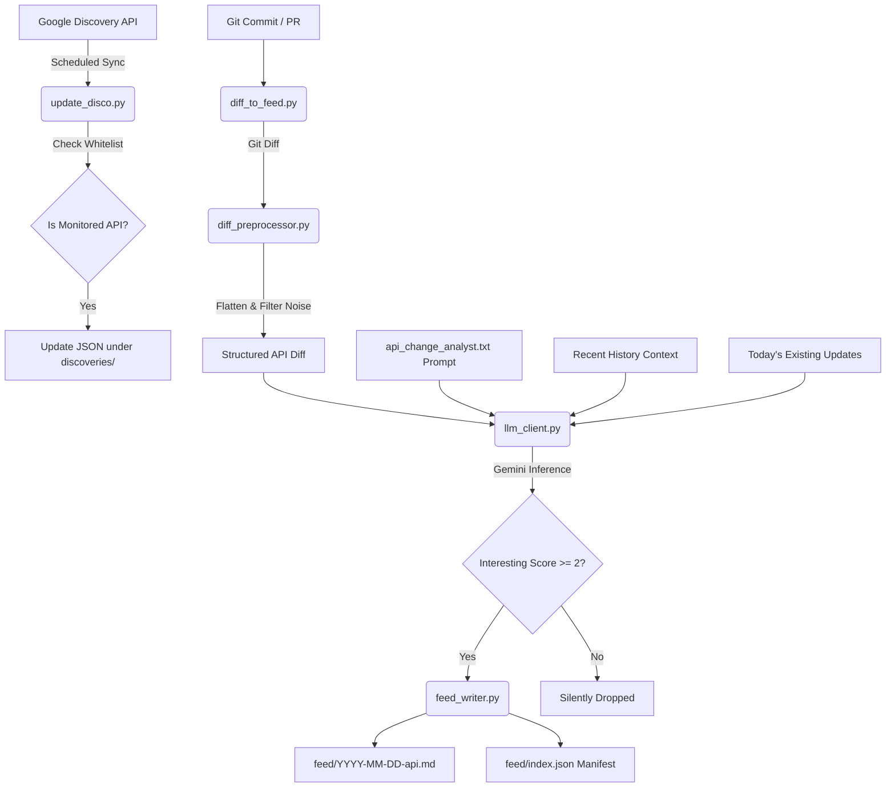

# Agentic Workflows & System Architecture

This repository is configured with automated agentic workflows to track, analyze, and publish insights about changes to Google Cloud Platform (GCP) APIs. 

By analyzing raw Google Discovery JSON schemas using LLM-based reasoning, this repository acts as a developer-facing changelog, highlighting new features, deprecations, and breaking changes.

---

## 🎯 Repository Goal

1. **Watch & Sync**: Regularly pull API definitions from the official Google API Discovery Service.
2. **Normalize**: Filter out noise (e.g., revision numbers, etags, dynamic endpoint URLs) and store normalized JSON documents under the [discoveries/](file:///Users/maxostapenko/GitHub/discovery-artifact-manager/discoveries) directory.
3. **Analyze**: Run a specialized **API Analyst Agent** (using Gemini) over the semantic differences to assess developer impact.
4. **Publish**: Generate and append developer-friendly Markdown updates to the [feed/](file:///Users/maxostapenko/GitHub/discovery-artifact-manager/feed) directory alongside a queryable [feed/index.json](file:///Users/maxostapenko/GitHub/discovery-artifact-manager/feed/index.json) manifest.

---

## 💡 Value Proposition & Future Vision

* **Early-Warning System (The "Sneak Peek")**: GCP API updates typically appear in the Google API Discovery Service metadata **weeks or even months** before they are officially documented in Google Cloud's release notes. This repository exposes changes before they are formally announced, giving developers a head start.
* **Promotional & Professional Integration**: The generated feed will serve as promotional content linked to my professional website to demonstrate real-time expertise and monitoring of GCP infrastructure.
* **Subscribable Feed**: Future efforts will make this feed subscribable (e.g., RSS, newsletter, or notifications) for developers and DevOps engineers who want direct, automated updates on Google's platform developments.

---

## ⚙️ Architecture & Workflow

---

## 🤖 The API Analyst Agent

The core intelligence of this repository lies in the Gemini-powered agent configured in [scripts/](file:///Users/maxostapenko/GitHub/discovery-artifact-manager/scripts).

### 1. Diff Preprocessing & Noise Reduction
* **Source file**: [diff_preprocessor.py](file:///Users/maxostapenko/GitHub/discovery-artifact-manager/scripts/diff_preprocessor.py)
* **How it works**: Before sending data to the LLM, the JSON structures are flattened into dot-notation paths (e.g., `resources.jobs.methods.query.parameters.createSession`).
* **Noise Filtering**: Structural elements like `revision`, `etag`, `rootUrl`, and ephemeral infrastructure changes (e.g., `endpoints`) are removed to avoid wasting LLM context window/tokens on non-semantic changes.

### 2. Context-Aware LLM Client
* **Source file**: [llm_client.py](file:///Users/maxostapenko/GitHub/discovery-artifact-manager/scripts/llm_client.py)
* **Model**: `gemini-3-flash-preview` (Vertex AI platform endpoint).
* **Conflict Resolution**:
  * **Today's Updates**: If an API was already modified earlier today, the agent receives the current daily update (`existing_today_content`) and merges the new diff into it, preventing duplicate entries and maintaining a single consolidated daily update.
  * **Historical Context**: The agent reads the most recent entries for the API (`recent_history_content`) to prevent downplaying or ignoring flapping changes (APIs appearing, disappearing, and reappearing).

### 3. Agent Instructions
* **Source file**: [prompts/api_change_analyst.txt](file:///Users/maxostapenko/GitHub/discovery-artifact-manager/scripts/prompts/api_change_analyst.txt)
* **Guiding Principles**:
  * Focus strictly on **developer impact** (what they can now build, or what might break).
  * Use precise, technical terms (exact parameter and method names) instead of generic statements.
  * Flag breaking changes explicitly.
  * Assign a realistic `interesting_score` (1-10) to categorize change significance.

### 4. Feed & Manifest Generation
* **Source file**: [feed_writer.py](file:///Users/maxostapenko/GitHub/discovery-artifact-manager/scripts/feed_writer.py)
* **Filtering**: Updates with an `interesting_score` below 2 (e.g., description typos, minor etag adjustments) are ignored.
* **Outputs**:
  * Markdown entries in [feed/](file:///Users/maxostapenko/GitHub/discovery-artifact-manager/feed) containing YAML frontmatter metadata (API name, impact category, breaking flags, and relevant tags).
  * An updated central catalog [feed/index.json](file:///Users/maxostapenko/GitHub/discovery-artifact-manager/feed/index.json) to enable static site generation, API dashboards, or programmatic consumption.

---

## 🛠️ Configuration & Customization

* **Change Monitored APIs**: Update the whitelist inside `load_documents()` in [update_disco.py](file:///Users/maxostapenko/GitHub/discovery-artifact-manager/scripts/update_disco.py).
* **Refine Agent Behavior**: Modify instructions, adjust tone, or fine-tune rules in [prompts/api_change_analyst.txt](file:///Users/maxostapenko/GitHub/discovery-artifact-manager/scripts/prompts/api_change_analyst.txt).
* **Change Scoring Thresholds**: Tweak `INTERESTING_SCORE_THRESHOLD` in [feed_writer.py](file:///Users/maxostapenko/GitHub/discovery-artifact-manager/scripts/feed_writer.py).
